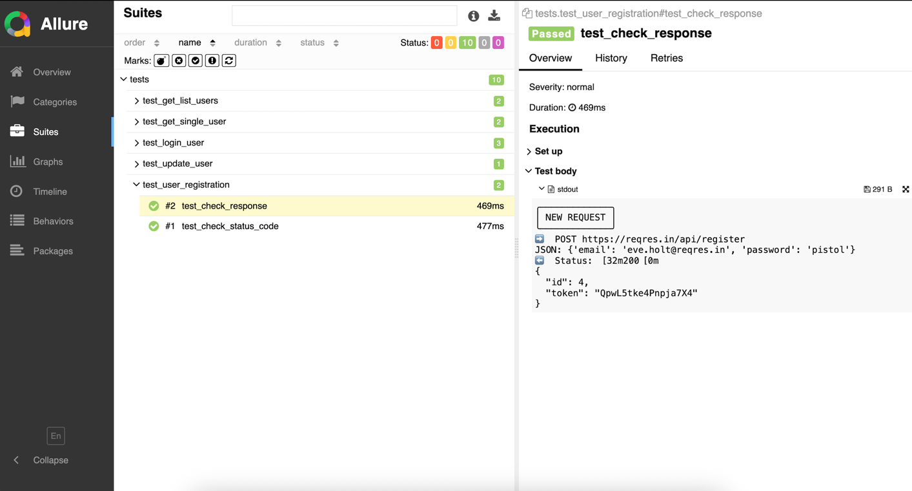

# 🧪 Python REST API Tests

## 📘 О проекте

Это репозиторий с авто-тестами написанными на  **Python 🐍** для платформы [reqres.in](https://reqres.in/)


---

## 🚀 Технологии
- `🌐 requests` - для работы с api 
- `⭕️ python-dotenv` - для работы с переменными окружения или секьюрными данными 
- `🟢 colorama` и `rich` - для более четкого понимания и наглядности результатов тестов в терминале в IDE
- `📝 pydantic` - для работы с моделями запросов, овтетов и ошибок 
- `🧪 pytest` - фреймворк для авто-тестирования
- `📊 allure-report` - для генерации отчетов о прохождении авто-тестов

---

## 📂 Структура проекта

```
auto-tests/
├───core                    # Логика обработки запросов/ответов и логирование
├───img                     # Скриншоты 
├───models                  # Модели ответов 
├───tests/                  # Тестовые сценарии
│   ├── test_get_list_users.py
│   ├── test_get_single_user.py
│   ├── test_login_user.py
│   ├── test_update_user.py
│   └── test_user_registration.py
├── conftest.py             # Фикстуры pytest
├── requirements.txt        # Зависимости проекта
└── README.md
```
---

## ⚙️ Установка и запуск

### 1️⃣ Клонируйте репозиторий:
```bash
  git clone https://github.com/imateenkovv/python_rest_tests.git
  cd python_rest_tests
```
### 2️⃣ Установите зависимости:

```bash
    pip install -r requirements.txt
```

### 3️⃣ Запустите тесты:

```bash
    pytest --alluredir=reports
```

### 4️⃣ Сгенерируйте отчёт Allure:

```bash
    allure serve allure-results
```
---
## 📈 Пример отчёта Allure


---
## 👨‍💻 Автор

- Илья Матеенков 
- QA Automation Engineer (Java/Python)
- 📎 GitHub: imateenkovv
- [Мое резюме](https://hh.ru/resume/4a1f3e52ff09c71d1e0039ed1f6f4b506b5837?hhtmFrom=resume_list)


